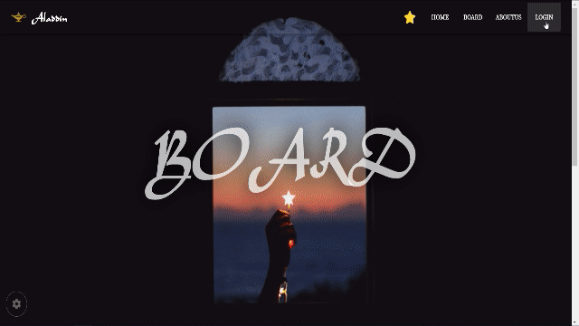

# Aladdin 컨셉 게시판

## Project setup
```
npm install
npm run serve
```

## 프로젝트 내용

* 알라딘 컨셉의 게시판입니다.
* 간단하게 회원가입, 로그인, 로그아웃, 게시판 CRUD를 만들었습니다.

### intro


### home


### login



### board write


### board detail


### aboutus


### banner Change


## 프로젝트 기간

* 2019.07.08 ~ 2019.07.19 (2주)

## Language

* javascript

## Framework

* Vuetify(UI)
* Vue.js(프론트엔드)
* firebase(백엔드)

## IDE

* VScode, webstorm